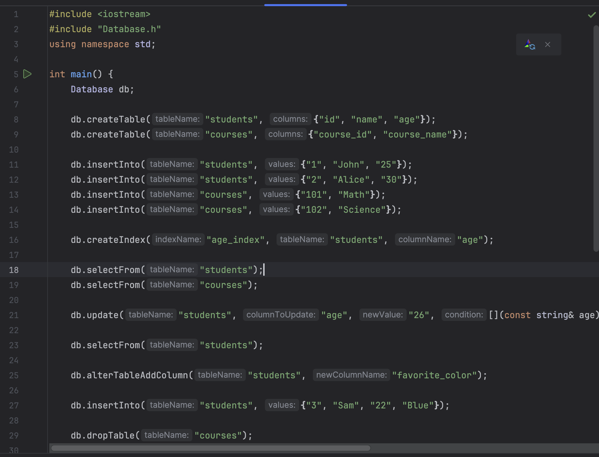

# Custom-SQL-Lite-Interpreter
 
Explanation and detailed docs: [Documentation.pdf](Documentation.pdf) file.

This project is a custom SQLite interpreter implemented in C++. Simulate a database on your computer locally in c++.

## Example main.cpp to implement everything

## Commands

- `createTable`: Creates a new table in the database.
- `insertInto`: Inserts data into a table in the database.
- `selectFrom`: Selects data from a table in the database.
- `deleteFrom`: Deletes data from a table in the database based on a condition.
- `update`: Updates data in a table in the database based on a condition.
- `alterTableAddColumn`: Adds a new column to a table in the database.
- `dropTable`: Drops a table from the database.
- `createIndex`: Creates an index on a column of a table in the database.
- `dropIndex`: Drops an index from the database.
- `createView`: Creates a view in the database.
- `dropView`: Drops a view from the database.
- `insertIntoSelect`: Inserts data into a table from the result of a SELECT query.
- `truncateTable`: Truncates a table in the database (removes all data).
- `printTable`: Prints the contents of a table in the database.

## Missing Commands
- `backupDatabase`
- `restoreDatabase`
- `beginTransaction`
- `commitTransaction`
- `rollbackTransaction`

feel free to contribute by implementing these missing commands

